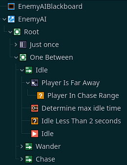

# Yet Another Behavior Tree

A Behavior Tree implementation for [Godot Engine](https://godotengine.org/)

## 📄 Features

➡️ This plugin is an implementation of well-known Behavior Trees, allowing game developers to create AI-Like behaviors for their NPCs. In addition to provide all behavior tree base nodes, this plugin also brings additional helper nodes that avoid to create custom ones.

➡️ As all behavior trees, this implementation provides a tree root called `BTRoot`. This node will contains all your AI logic. Root node only accept a unique behavior tree node as child, which is a composite node. Composite nodes defines the root of a tree branch : each branch can be seen as a *rule* for your AI. They accept any kind of behavior tree nodes as children. It can either be a composite, decorator or leaf nodes. Decorator nodes allow to customize result of its only child node. Leaf nodes, as their name implies, do not have any child. They represents basic unit of work of your AI, which can be separated into two notions: conditions and actions.

➡️ In some cases, you will need to share information between your AI nodes. To avoid to create side scripts and/or stateful entities, this behavior tree also provides the notion of Blackboard. In a blackboard, you can store key-value datas. They can be retrieve and updated from any node in your tree. Blackboard is not erased between tree execution, meaning you can store persistent datas in it.

*(See below for full node documentation)*

➡️ Having nice features is cool, but beeing able to use them in an easy way is cooler 😎. **Yet Another Behavior Tree** provides a nice Godot Editor integration throught
- A set on uniform and beautiful (😂) node icons, that make it easier to identify what each node is and what it is doing in the *Scene* view,
- Configuration warning in *Scene* view if your behavior tree is not well configured,
- Easy node configuration through exported variables

## 📄 Nodes Documentation

###  BTBlackboard

Blackboard allows to share data across nodes and behavior trees. You can create/retreieve/erase pairs of key-value. Keys and values are variants and can be anything.

Some well-known properties are already fed by the root tree during execution :
- `delta` : the float value of delta from *process* or *physics process* (depending on root tree process mode).

🔑 Properties list:
- `data` : a dictionnary allowing to specifies default entries before tree first execution.

###   BTRoot

Its the entry point of your behavior tree. It can only have a unique child of type `BTComposite`.

🔑 Properties list:
- `enabled` : indicates if tree should run or non. Default is *on*,
- `root_process_mode` : indicates whether tree should execute during *process* or *physics process*. Default is *physics process*,
- `actor_path` : path to the node that the tree is drescribing actions for. This is the node that will be passed to all tree nodes, allowing you to manipulate the actor at every tree step. Default is *empty*.
- `blackboard` : path to the blackboard node. This allows to share a same blackboard between several trees, for example to code a group of enemies acting together, or to spécify some default entries using the editor. If empty, a default empty blackboard will be used during tree execution. Default is *empty*.

###   BTSelector

The selector node is a *composite node* that executes its children from the first one to the last one, in order, until one of them returns *SUCCESS*. If a selector child succeeds, the selector succeed too. If all selector children failed, the selector fails too.

🔑 Properties list:
- `save_progression` : indicates whether the selector should resume to the last running child on next tree execution (*on*), or restart from its first child (*off*). Its usefull to describe a non-interruptible action, or to optimize process time. Default is *off*.

###   BTRandomSelector

The random selector node is a *composite node* behaves like the `BTSelector` node, except that it executes its children in random order.

🔑 Properties list:
- `save_progression` : indicates whether the random selector should resume to the last running child on next tree execution (*on*), or restart from its first child (*off*). Its usefull to describe a non-interruptible action, or to optimize process time. Default is *off*.

###   BTSequence

The sequence node is a *composite node* that executes its children from the first one to the last one, until all children succeed or one of its children fails. Il all children succedd, the sequence succeeds too ; if one child fails, the sequence fails too.

🔑 Properties list:
- `save_progression` : indicates whether the sequence should resume to the last running child on next tree execution (*on*), or restart from its first child (*off*). Its usefull to describe a non-interruptible action, or to optimize process time. Default is *off*.
-
###  Decorator Nodes

###  Leaf Nodes
